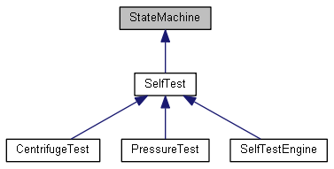
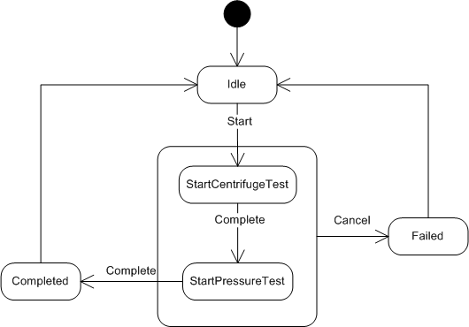

[](https://github.com/endurodave/AsyncStateMachine/actions/workflows/cmake_ubuntu.yml)
[](https://github.com/endurodave/AsyncStateMachine/actions/workflows/cmake_clang.yml)
[](https://github.com/endurodave/AsyncStateMachine/actions/workflows/cmake_windows.yml)

# Asynchronous State Machine Design in C++

A thread-safe C++ Finite State Machine implemented as an Active Object, utilizing an asynchronous Signal-Slot library for decoupled, cross-thread event dispatching.

# Table of Contents
- [Asynchronous State Machine Design in C++](#asynchronous-state-machine-design-in-c)
- [Table of Contents](#table-of-contents)
- [Introduction](#introduction)
  - [References](#references)
- [Getting Started](#getting-started)
- [Asynchronous Delegates](#asynchronous-delegates)
  - [Memory Safety and Deep Copy](#memory-safety-and-deep-copy)
- [AsyncStateMachine](#asyncstatemachine)
- [Motor Example](#motor-example)
- [Self-Test Subsystem Example](#self-test-subsystem-example)
  - [SelfTestEngine](#selftestengine)
  - [CentrifugeTest](#centrifugetest)
  - [Timer](#timer)
  - [Run-Time](#run-time)
- [Conclusion](#conclusion)

# Introduction

A software-based Finite State Machine (FSM) is an implementation method used to decompose a design into discrete states and events. Simple embedded devices with no operating system employ single-threading where state machines execute on a single execution loop. More complex systems utilize multithreading to partition processing across multiple cores or priority levels.

This repository demonstrates how to implement C++ state machines within a multithreaded environment. The `AsyncStateMachine` class extends the functionality of the core engine documented in [State Machine Design in C++](https://github.com/endurodave/StateMachine). This asynchronous implementation utilizes `std::thread` for cross-platform support on Windows and Linux, as covered in [C++ std::thread Event Loop](https://github.com/endurodave/StdWorkerThread), though it can be easily adapted to any OS-specific threading model.

To handle inter-thread communication, `AsyncStateMachine` leverages the [DelegateMQ](https://github.com/endurodave/DelegateMQ) asynchronous Signal-Slot library. This allows the state machine to function as an **Active Object**, where events and transitions are safely marshaled to a dedicated thread of control, ensuring thread-safety without manual mutex locking.

The goal of this project is to provide a complete, production-ready example featuring threads, timers, and state machines working in concert. The included example implements a hierarchical self-test engine that utilizes asynchronous Signal-Slot communication to coordinate multiple sub-test state machines.

This article focuses specifically on the `AsyncStateMachine` enhancement and its integration with the `DelegateMQ` library; the underlying state machine and delegate implementations are documented in their respective repositories.

## References

| Project | Description |
| :--- | :--- |
| [**State Machine Design in C++**](https://github.com/endurodave/StateMachine) | A compact, header-only C++ finite state machine implementation supporting internal/external events and state inheritance. |
| [**DelegateMQ in C++**](https://github.com/endurodave/DelegateMQ) | A modern messaging library providing a thread-safe Signal-Slot mechanism for synchronous and asynchronous function invocation. |
| [**C++ std::thread Event Loop**](https://github.com/endurodave/StdWorkerThread) | A lightweight, thread-safe event loop and worker thread implementation using the standard C++ thread support library. |

# Getting Started
[CMake](https://cmake.org/) is used to create the project build files on any Windows or Linux machine.

1. Clone the repository.
2. From the repository root, run the following CMake command:   
   `cmake -B Build .`
3. Build and run the project within the `Build` directory. 

# Asynchronous Delegates

If you’re not familiar with a delegate, the concept is quite simple. A delegate can be thought of as a super function pointer. In C++, there's no pointer type capable of pointing to all the possible function variations: instance member, virtual, const, static, lambda, and free (global). A function pointer can’t point to instance member functions, and pointers to member functions have all sorts of limitations. However, delegate classes can, in a type-safe way, point to any function provided the function signature matches. In short, a delegate points to any function with a matching signature to support anonymous function invocation.

Asynchronous delegates take the concept further and permit anonymous invocation of any function on a client specified thread of control. The function and all arguments are safely called from a destination thread simplifying inter-thread communication and eliminating cross-threading errors. The repository [DelegateMQ](https://github.com/endurodave/DelegateMQ) covers usage patterns in detail.

The `AsyncStateMachine` uses asynchronous delegates to inject external events into a state machine instance.

## Memory Safety and Deep Copy

A critical challenge in asynchronous multi-threading is managing the lifetime of data passed between threads. If a caller passes a pointer to a local (stack) variable to another thread, the caller's stack may be cleaned up before the destination thread has a chance to process the data, leading to "dead pointer" crashes.

`AsyncStateMachine` leverages DelegateMQ's automated heap-marshaling to solve this. When an external event is fired using a pointer to an object, the library automatically performs a Deep Copy of the underlying data onto the heap.

1. **Safety:** The destination thread receives its own private, persistent clone of the data.

2. **Automation:** The library manages the life cycle, deleting the cloned object automatically after the state transition is complete.
 
3. **Requirement:** For this to work, the event data class (e.g., MotorData) must have a valid copy constructor.

# AsyncStateMachine

The `AsyncStateMachine` inherits from `StateMachine`. Create a state machine thread using `CreateThread()` or alternatively attach an existing thread using `SetThread()`. 

```cpp
class AsyncStateMachine : public StateMachine
{
public:
    ///	Constructor.
    ///	@param[in] maxStates - the maximum number of state machine states.
    AsyncStateMachine(BYTE maxStates, BYTE initialState = 0);

    /// Destructor
    virtual ~AsyncStateMachine();

    /// Create a new thread for this state machine
    /// @param[in] threadName - the thread name
    void CreateThread(const std::string& threadName);

    /// Set a thread for this state machine
    /// @param[in] thread - a Thread instance
    void SetThread(std::shared_ptr<Thread> thread) { m_thread = thread;  }

    /// Get the thread attached to this state machine
    /// @return A Thread instance
    std::shared_ptr<Thread> GetThread() { return m_thread; }

protected:
    /// @see StateMachine::ExternalEvent()
    void ExternalEvent(BYTE newState, const EventData* pData = NULL);

private:
    // The worker thread instance the state machine executes on
    std::shared_ptr<Thread> m_thread = nullptr;
};
```

Converting a state machine from `StateMachine` to `AsyncStateMachine` requires these changes:

1. Inherit from `AsyncStateMachine`.
2. Add `ASYNC_INVOKE()` to all external event functions.
3. Call `CreateThread()` or `SetThread()` to attach a thread.

# Motor Example

The `Motor` state machine diagram is shown below.


`Motor` inherits from `AsyncStateMachine` and implements two external events and four states.

```cpp
#ifndef _MOTOR_H
#define _MOTOR_H

#include "AsyncStateMachine.h"

class MotorData : public EventData
{
public:
    INT speed;
};

// Motor is an asynchronous state machine. All external events are executed
// on the Motor thread of control. The DelegateMQ library handles invoking 
// functions asynchronously.
class Motor : public AsyncStateMachine
{
public:
    Motor();

    // External events taken by this state machine
    void SetSpeed(MotorData* data);
    void Halt();

private:
    INT m_currentSpeed; 

    // State enumeration order must match the order of state method entries
    // in the state map.
    enum States
    {
        ST_IDLE,
        ST_STOP,
        ST_START,
        ST_CHANGE_SPEED,
        ST_MAX_STATES
    };

    // Define the state machine state functions with event data type
    STATE_DECLARE(Motor, 	Idle,			NoEventData)
    STATE_DECLARE(Motor, 	Stop,			NoEventData)
    STATE_DECLARE(Motor, 	Start,			MotorData)
    STATE_DECLARE(Motor, 	ChangeSpeed,	MotorData)

    // State map to define state object order. Each state map entry defines a
    // state object.
    BEGIN_STATE_MAP
        STATE_MAP_ENTRY(&Idle)
        STATE_MAP_ENTRY(&Stop)
        STATE_MAP_ENTRY(&Start)
        STATE_MAP_ENTRY(&ChangeSpeed)
    END_STATE_MAP	
};

#endif
```

The `Motor::SetSpeed()` external event uses the `ASYNC_INVOKE()` macro to invoke the function on the `Motor` thread of control using the `DelegateMQ` library. `ASYNC_INVOKE()` is non-blocking and inserts a message into the `Motor` thread's event queue with pointers to the function and argument, then early returns. Later, the `Motor` thread dequeues the message and calls `Motor::SetSpeed()` on `Motor`'s thread context. The `SetSpeed()` external event function is thread-safe callable by anyone.

```cpp
void Motor::SetSpeed(MotorData* data)
{
    /* ASYNC_INVOKE below effectively executes the following code:
    // Is this function call executing on this state machine thread?
    if (GetThreadId() != Thread::GetCurrentThreadId())
    {
        // Asynchronously re-invoke the SetSpeed() event on Motor's thread
        AsyncInvoke(this, &Motor::SetSpeed, *GetThread(), data);
        return;
    }*/

    // Asynchronously invoke Motor::SetSpeed on the Motor thread of control
    ASYNC_INVOKE(Motor, SetSpeed, data);

    BEGIN_TRANSITION_MAP			              			// - Current State -
        TRANSITION_MAP_ENTRY (ST_START)						// ST_IDLE
        TRANSITION_MAP_ENTRY (CANNOT_HAPPEN)				// ST_STOP
        TRANSITION_MAP_ENTRY (ST_CHANGE_SPEED)				// ST_START
        TRANSITION_MAP_ENTRY (ST_CHANGE_SPEED)				// ST_CHANGE_SPEED
    END_TRANSITION_MAP(data)
}
```

The `Motor` constructor creates the thread at runtime.

```cpp
Motor::Motor() :
    AsyncStateMachine(ST_MAX_STATES),
    m_currentSpeed(0)
{
    CreateThread("Motor");
}
```

# Self-Test Subsystem Example

Self-tests execute a series of tests on hardware and mechanical systems to ensure correct operation. In this example, there are four state machine classes implementing our self-test subsystem as shown in the inheritance diagram below:



## SelfTestEngine

`SelfTestEngine` is thread-safe and the main point of contact for client’s utilizing the self-test subsystem. `CentrifugeTest` and `PressureTest` are members of `SelfTestEngine`. `SelfTestEngine` is responsible for sequencing the individual self-tests in the correct order as shown in the state diagram below. 



The `Start` event initiates the self-test engine. `SelfTestEngine::Start()` is an asynchronous function that reinvokes the function on the state machine's execution thread. 

```cpp
void SelfTestEngine::Start(const StartData* data)
{
    // Asynchronously invoke SelfTestEngine::Start on the SelfTestEngine thread of control
    ASYNC_INVOKE(SelfTestEngine, Start, data);

    BEGIN_TRANSITION_MAP			              			// - Current State -
        TRANSITION_MAP_ENTRY (ST_START_CENTRIFUGE_TEST)		// ST_IDLE
        TRANSITION_MAP_ENTRY (CANNOT_HAPPEN)				// ST_COMPLETED
        TRANSITION_MAP_ENTRY (CANNOT_HAPPEN)				// ST_FAILED
        TRANSITION_MAP_ENTRY (EVENT_IGNORED)				// ST_START_CENTRIFUGE_TEST
        TRANSITION_MAP_ENTRY (EVENT_IGNORED)				// ST_START_PRESSURE_TEST
    END_TRANSITION_MAP(data)
}
```

When each self-test completes, the `Complete` event fires causing the next self-test to start. After all of the tests are done, the state machine transitions to `Completed` and back to `Idle`. If the `Cancel` event is generated at any time during execution, a transition to the `Failed` state occurs.

The `SelfTest` base class provides three states common to all `SelfTest`-derived state machines: `Idle`, `Completed`, and `Failed`. `SelfTestEngine` then adds two more states: `StartCentrifugeTest` and `StartPressureTest`.

`SelfTestEngine` has one public event function, `Start()`, that starts the self-tests. `SelfTestEngine::OnStatus` is an asynchronous callback allowing client’s to register for status updates during testing.

```cpp
class SelfTestEngine : public SelfTest
{
public:
	// Clients register for asynchronous self-test status callbacks via Signal-Slot
	static inline dmq::SignalPtr<void(const SelfTestStatus&)> OnStatus =
		dmq::MakeSignal<void(const SelfTestStatus&)>();

	static SelfTestEngine& GetInstance();

	void Start(const StartData* data);

	static void InvokeStatusSignal(std::string msg);

private:
	SelfTestEngine();
	void Complete();

	CentrifugeTest m_centrifugeTest;
	PressureTest m_pressureTest;

	StartData m_startData;

	// RAII Connection Handles
	// These MUST be stored to keep the signal connections alive
	dmq::ScopedConnection m_centrifugeCompleteConn;
	dmq::ScopedConnection m_centrifugeFailedConn;
	dmq::ScopedConnection m_pressureCompleteConn;
	dmq::ScopedConnection m_pressureFailedConn;

	enum States
	{
		ST_START_CENTRIFUGE_TEST = SelfTest::ST_MAX_STATES,
		ST_START_PRESSURE_TEST,
		ST_MAX_STATES
	};

	STATE_DECLARE(SelfTestEngine, StartCentrifugeTest, StartData)
	STATE_DECLARE(SelfTestEngine, StartPressureTest, NoEventData)

	BEGIN_STATE_MAP
		STATE_MAP_ENTRY(&Idle)
		STATE_MAP_ENTRY(&Completed)
		STATE_MAP_ENTRY(&Failed)
		STATE_MAP_ENTRY(&StartCentrifugeTest)
		STATE_MAP_ENTRY(&StartPressureTest)
	END_STATE_MAP
};
```

As mentioned previously, the `SelfTestEngine` registers for asynchronous callbacks from each sub self-tests (i.e. `CentrifugeTest` and `PressureTest`) as shown below. When a sub self-test state machine completes, the `SelfTestEngine::Complete()` function is called. When a sub self-test state machine fails, the `SelfTestEngine::Cancel()` function is called.

Note that `m_centrifugeTest` and `m_pressureTest` share the same `SelfTestEngine` thread instance. This means all self-tests execute on the same thread.

```cpp
SelfTestEngine::SelfTestEngine() :
    SelfTest("SelfTestEngine", ST_MAX_STATES)
{
    // Set owned state machines to execute on SelfTestEngine thread of control
    m_centrifugeTest.SetThread(GetThread());
    m_pressureTest.SetThread(GetThread());

    // CONNECT SIGNALS (RAII)
    // Register for signals when sub self-test state machines complete or fail.
    // We store the connection handles to ensure they stay connected.
    m_centrifugeCompleteConn = m_centrifugeTest.OnCompleted->Connect(
        MakeDelegate(this, &SelfTestEngine::Complete));

    m_centrifugeFailedConn = m_centrifugeTest.OnFailed->Connect(
        MakeDelegate<SelfTest>(this, &SelfTest::Cancel));

    m_pressureCompleteConn = m_pressureTest.OnCompleted->Connect(
        MakeDelegate(this, &SelfTestEngine::Complete));

    m_pressureFailedConn = m_pressureTest.OnFailed->Connect(
        MakeDelegate<SelfTest>(this, &SelfTest::Cancel));
}
```

The `SelfTest` base class generates the `OnCompleted` and `OnFailed` within the `Completed` and `Failed` states respectively as seen below:

```cpp
STATE_DEFINE(SelfTest, Completed, NoEventData)
{
    SelfTestEngine::InvokeStatusSignal("SelfTest::ST_Completed");

    // Use SignalPtr and dereference to invoke connected slots
    if (OnCompleted)
        (*OnCompleted)();

    InternalEvent(ST_IDLE);
}

STATE_DEFINE(SelfTest, Failed, NoEventData)
{
    SelfTestEngine::InvokeStatusSignal("SelfTest::ST_Failed");

    // Use SignalPtr and dereference to invoke connected slots
    if (OnFailed)
        (*OnFailed)();

    InternalEvent(ST_IDLE);
}
```

One might ask why the state machines use asynchronous delegate signals. If the state machines are on the same thread, why not use a normal, synchronous callback instead? The problem to prevent is a callback into a currently executing state machine, that is, the call stack wrapping back around into the same class instance. For example, the following call sequence should be prevented: `SelfTestEngine` calls `CentrifugeTest` calls back `SelfTestEngine`. An asynchronous callback allows the stack to unwind and prevents this unwanted behavior.

## CentrifugeTest

The `CentrifugeTest` state machine diagram shown below implements the centrifuge self-test. `CentrifugeTest` uses state machine inheritance by inheriting the `Idle`, `Completed` and `Failed` states from the `SelfTest` class. The `Timer` class is used to provide `Poll` events via asynchronous delegate callbacks.


## Timer

The `Timer` class provides a common mechanism to receive function callbacks by registering with `OnExpired`. `Start()` starts the callbacks at a particular interval. `Stop()` stops the callbacks.

```cpp
class Timer
{
public:
    /// Clients register with OnExpired to get timer callbacks
    dmq::SignalPtr<void(void)> OnExpired;

    /// Constructor
    Timer(void);

    /// Destructor
    ~Timer(void);

    /// Starts a timer for callbacks on the specified timeout interval.
    /// @param[in] timeout - the timeout.
    /// @param[in] once - true if only one timer expiration
    void Start(dmq::Duration timeout, bool once = false);

    /// Stops a timer.
    void Stop();

    // etc...
```

## Run-Time

The program’s `main()` function is shown below. It creates the two threads, registers for callbacks from `SelfTestEngine`, then calls `Start()` to start the self-tests.

```cpp
int main(void)
{
	// Start the thread that will run ProcessTimers
	std::thread timerThread(ProcessTimers);

	try
	{
		// Create the worker thread
		userInterfaceThread.CreateThread();

		// *** Begin async Motor test ***
		Motor motor;

		auto data = new MotorData();
		data->speed = 100;
		motor.SetSpeed(data);

		data = new MotorData();
		data->speed = 200;
		motor.SetSpeed(data);

		motor.Halt();
		// *** End async Motor test ***

		// *** Begin async self test ***		
		// -------------------------------------------------------------------------
		// CONNECT SIGNALS (RAII)
		// -------------------------------------------------------------------------
		// We must store the connection handles!
		// If these fall out of scope, they automatically disconnect.
		ScopedConnection statusConn;
		ScopedConnection completeConn;

		// Register for status updates (Static Signal)
		statusConn = SelfTestEngine::OnStatus->Connect(
			MakeDelegate(&OnSelfTestEngineStatus, userInterfaceThread)
		);

		// Register for completion (Instance Signal from base class)
		completeConn = SelfTestEngine::GetInstance().OnCompleted->Connect(
			MakeDelegate(&OnSelfTestEngineComplete, userInterfaceThread)
		);

		// Start self-test engine
		StartData startData;
		startData.shortSelfTest = TRUE;
		SelfTestEngine::GetInstance().Start(&startData);

		// Wait for self-test engine to complete 
		while (!selfTestEngineCompleted)
			std::this_thread::sleep_for(std::chrono::milliseconds(10));

		// -------------------------------------------------------------------------
		// DISCONNECT
		// -------------------------------------------------------------------------
		// Explicitly disconnect (optional, as destructors handle this automatically)
		statusConn.Disconnect();
		completeConn.Disconnect();
		// *** End async self test **

		// Exit the worker thread
		userInterfaceThread.ExitThread();
	}
	catch (...)
	{
		std::cerr << "Exception!" << std::endl;
	}

	// Ensure the timer thread completes before main exits
	processTimerExit.store(true);
	if (timerThread.joinable())
		timerThread.join();

	return 0;
}
```

`SelfTestEngine` generates asynchronous callbacks on the `UserInteface` thread. The `SelfTestEngineStatusCallback()` callback outputs the message to the console.

```cpp
void OnSelfTestEngineStatus(const SelfTestStatus& status)
{
	// Output status message to the console "user interface"
	cout << status.message.c_str() << endl;
}

void OnSelfTestEngineComplete()
{
	selfTestEngineCompleted = true;
}
```

# Conclusion

The `AsyncStateMachine` class allows state machine objects to operate in their own thread context. The `DelegateMQ` library offer cross-thread event generation for easy collaboration between state machines.

